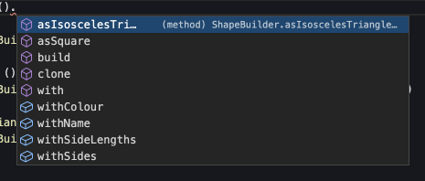

# TypeScript Dossier (ts-dossier)

> A support library to facilitate the easy creation of test data [builders](https://en.wikipedia.org/wiki/Builder_pattern) for use with an [Object-Mother](https://www.martinfowler.com/bliki/ObjectMother.html) pattern in TypeScript

[![npm package][npm-img]][npm-url]
[![Build Status][build-img]][build-url]
[![Downloads][downloads-img]][downloads-url]
[![Issues][issues-img]][issues-url]
[![Semantic Release][semantic-release-img]][semantic-release-url]

## Install

```bash
npm install @makerx/ts-dossier --save-dev
```

## Usage

The first step is to define a model

```ts
type Colour = 'Blue' | 'Red' | 'Yellow' | 'Green'

export type Shape = {
  name: string
  sides: number
  sideLengths: number[]
  colour: Colour
}
```

Then define a Builder for that model

```ts
import { randomElement, randomNumberBetween, randomString } from '@makerx/ts-dossier'
import { DataBuilder, dossierProxy } from '@makerx/ts-dossier'
import { Shape } from './shape'

function generateSideLengths(sides: number) {
  return [...Array(sides).keys()].map((_) => randomNumberBetween(1, 999))
}

class ShapeBuilder extends DataBuilder<Shape> {
  constructor() {
    const sides = randomNumberBetween(1, 4)
    super({
      name: randomString(10, 20),
      sides,
      sideLengths: generateSideLengths(sides),
      colour: randomElement(['Blue', 'Red', 'Yellow', 'Green']),
    })
  }

  public withSides(sides: number) {
    this.with('sides', sides)
    if (this.thing.sideLengths.length != sides) {
      this.with('sideLengths', generateSideLengths(sides))
    }
    return this
  }

  public asSquare(length: number) {
    this.thing = {
      ...this.thing,
      name: 'Square',
      sides: 4,
      sideLengths: [length, length, length, length],
    }
    return this
  }

  public asIsoscelesTriangle(length: number, perimeter: number) {
    this.thing = {
      ...this.thing,
      name: 'Isosceles triangle',
      sides: 3,
      sideLengths: [length, length, perimeter - length * 2],
    }
    return this
  }
}

export const shapeBuilder = dossierProxy<ShapeBuilder, Shape>(ShapeBuilder)
```

With the builder defined, and using the dossier proxy, you now have access to the builder methods supplied by the builder itself and the ones defined for you by the Dossier proxy.



Then define a mother to build known models for testing

```ts
import { shapeBuilder } from './shape-builder'

export const shapeMother = {
  blueSquare: () => {
    return shapeBuilder().asSquare(20).withColour('Blue')
  },
  greenTriangle: () => {
    return shapeBuilder().withName('Triangle').withSides(3).withColour('Green')
  },
  redIsoscelesTriangle: () => {
    return shapeBuilder().asIsoscelesTriangle(20, 45).withColour('Red')
  },
}
```

And write some tests

```ts
import { describe, expect, it } from '@jest/globals'
import { shapeMother } from './shape-mother'

describe('The square', () => {
  it('has four sides', () => {
    const shape = shapeMother.blueSquare().build()
    expect(shape.sides).toBe(4)
  })
  it('has four sides of equal length', () => {
    const shape = shapeMother.blueSquare().build()
    expect(shape.sideLengths).toEqual(expect.arrayContaining([...Array(4)].map((_) => shape.sideLengths[0])))
  })
  it('is named correctly', () => {
    const shape = shapeMother.blueSquare().build()
    expect(shape.name).toBe('Square')
  })
  it('is coloured blue', () => {
    const shape = shapeMother.blueSquare().build()
    expect(shape.colour).toBe('Blue')
  })
})
describe('The isosceles triangle', () => {
  it('has three sides', () => {
    const shape = shapeMother.redIsoscelesTriangle().build()
    expect(shape.sides).toBe(3)
  })
  it('has two sides of equal length', () => {
    const shape = shapeMother.redIsoscelesTriangle().build()
    expect(shape.sideLengths.reduce<number[]>((a, c) => (a.includes(c) ? a : [...a, c]), [])).toHaveLength(2)
  })
  it('is named correctly', () => {
    const shape = shapeMother.redIsoscelesTriangle().build()
    expect(shape.name).toBe('Isosceles triangle')
  })
  it('is coloured red', () => {
    const shape = shapeMother.redIsoscelesTriangle().build()
    expect(shape.colour).toBe('Red')
  })
})
```

Try it out on [StackBlitz](https://stackblitz.com/edit/node-au9p8x?file=shape.spec.ts)

## Random Data Builders

Dossier comes with a variety of random data builders - View detailed function descriptions includes arguments in the [code docs](https://makerxstudio.github.io/ts-dossier/docs/modules~data_utilties).

| Name                      | Function            | Other                                                                        |
|---------------------------|---------------------|------------------------------------------------------------------------------|
| Number                    | randomNumber        |                                                                              |
| Number between            | randomNumberBetween |                                                                              |
| Float between             | randomFloatBetween  |                                                                              |
| String                    | randomString        |                                                                              |
| ID                        | randomId            |                                                                              |
| Date                      | randomDate          |                                                                              |
| Date between              | randomDateBetween   |                                                                              |
| Boolean                   | randomBoolean       |                                                                              |
| Incremented number        | incrementedNumber   | Returns a unique incremented number. Call `resetIncrementedNumbers` to reset |
| Element from a collection | randomElement       |                                                                              |
| Name of a thing           | randomThingName     |                                                                              |
| Name of a person          | randomPersonName    |                                                                              |
| Email                     | randomEmail         |                                                                              |
| Phone number              | randomPhoneNumber   |                                                                              |
| URL                       | randomUrl           |                                                                              |


[build-img]:https://github.com/MakerXStudio/ts-dossier/actions/workflows/release.yml/badge.svg
[build-url]:https://github.com/MakerXStudio/ts-dossier/actions/workflows/release.yml
[downloads-img]:https://img.shields.io/npm/dt/@MakerXStudio/ts-dossier
[downloads-url]:https://www.npmtrends.com/@makerx/ts-dossier
[npm-img]:https://img.shields.io/npm/v/@makerx/ts-dossier
[npm-url]:https://www.npmjs.com/package/@makerx/ts-dossier
[issues-img]:https://img.shields.io/github/issues/MakerXStudio/ts-dossier
[issues-url]:https://github.com/MakerXStudio/ts-dossier/issues
[semantic-release-img]:https://img.shields.io/badge/%20%20%F0%9F%93%A6%F0%9F%9A%80-semantic--release-e10079.svg
[semantic-release-url]:https://github.com/semantic-release/semantic-release
